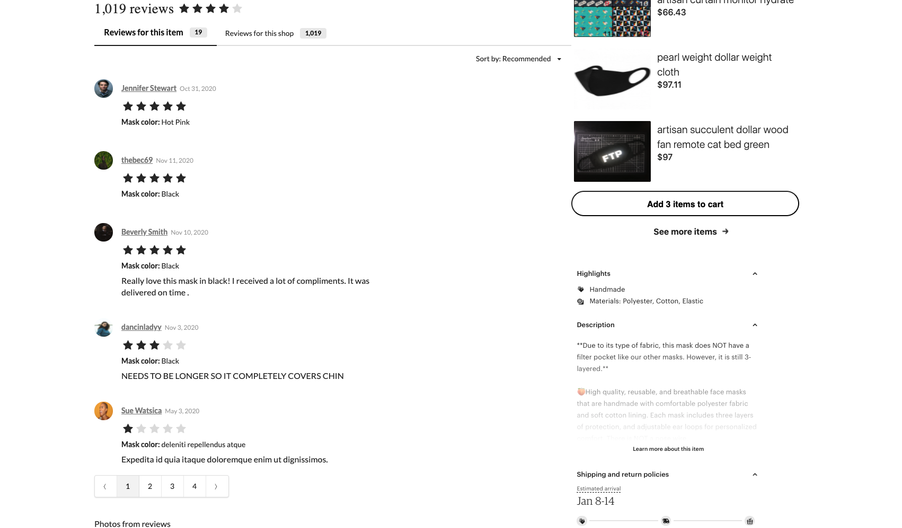
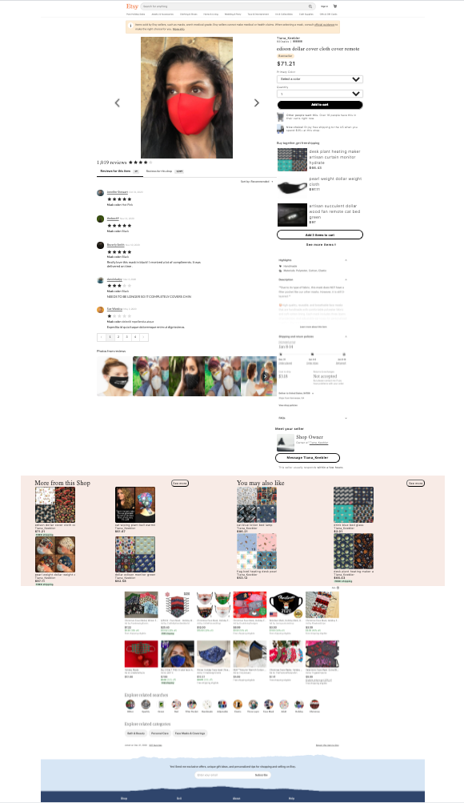

# f-Etsy Reviews

> An "item detail page" from https://etsy.com with four significant and functionally unique modules ("widgets") on the page. This is a recreation of the Reviews module ("widget").





Highlighted Technologies: React, React Semantic UI, Express, mySQL, Jest, Webpack, AWS S3 + EC2

## Table of Contents

1. [Getting Started](#Getting)
2. [Testing](#Testing)
3. [Related Projects](#Related)

## Getting Started

From within the root directory:

```
npm install
```

To run on a local machine, start mySQL service and in database/index.js on line 3 and line 10 update root user and password that matches your local machine mySQL.

For mySQL EC2 instance, a new credential and user name may need to be created with all admin rights for set up and database seeding to work properly. Need to update client/src/main.jsx axios get request path on line 35 to EC2 instance IP address.

To seed the database

```
node database/index.js
npm run seed-db
```

To start webpack

```
npm run react-dev
```

Start the server (on port 3002)

```
npm run start
```

## Testing

```
npm run test
```

## Related Projects

- https://github.com/rpt24sourcandy/fetsyItemImages
- https://github.com/rpt24sourcandy/fetsySeller
- https://github.com/rpt24sourcandy/fetsyReviews
- https://github.com/rpt24sourcandy/fetsyShopping
- https://github.com/rpt24sourcandy/fetsyReviewsProxy
